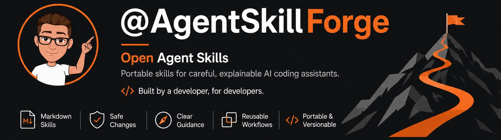

[English](README.md) · **Deutsch**

# AgentSkillForge



[](https://github.com/RobinGru/AgentSkillForge/actions/workflows/validate.yml)
[](https://github.com/RobinGru/AgentSkillForge/actions/workflows/runtime-evals.yml)
[](https://github.com/RobinGru/AgentSkillForge/actions/workflows/codeql.yml)
[](LICENSE)
[](pyproject.toml)

Wiederverwendbare Agent Skills, die KI-Coding-Assistenten zu sorgfältigen Änderungen und verständlichen Ergebnissen anleiten.

[Skills entdecken](#skill-katalog) · [Getrackte Features liefern](#getrackte-feature-lieferung) · [Mit Zed oder Codex installieren](#schnellstart) · [All-in-one-Vorlage nutzen](#all-in-one-anweisungen-für-projekte) · [Mitwirken](CONTRIBUTING.md)

> [!NOTE]
> Statische Repository-Prüfungen laufen für jeden Pull Request. Deterministische Runtime-Contract-Checks prüfen den Eval-Runner, während authentifizierte Codex-Smoke-Tests und interaktive Zed-Prüfungen optionale Release-Belege sind. Die [Kompatibilitäts- und Wartungsrichtlinie](docs/compatibility.md) beschreibt die Support-Matrix und ihre klaren Grenzen.

## Was ist AgentSkillForge?

AgentSkillForge ist eine Sammlung kleiner, wiederverwendbarer Agent Skills für KI-Coding-Assistenten. Jeder Skill beschreibt einen Aufgabentyp, die zu sammelnden Belege, nötige Entscheidungen und die Form des Ergebnisses.

Agent Skills sind einfache Markdown-Verzeichnisse mit einer zentralen `SKILL.md`. Sie sind damit nicht an einen bestimmten Client gebunden. Dieses Repository bietet dokumentierte Installer für Zed und Codex; andere Clients benötigen ihren eigenen dokumentierten Mechanismus zum Laden kompatibler Skill-Verzeichnisse.

## Warum verwenden?

- **Gezielte Anleitung:** Wähle einen Skill für die konkrete Aufgabe statt eines allgemeinen Workflows.
- **Belege vor Annahmen:** Skills unterscheiden Beobachtungen, Schlussfolgerungen und nicht ausgeführte Prüfungen.
- **Portable Agent Skills:** Kopiere ein vollständiges Skill-Verzeichnis in einen kompatiblen Client – ohne Python-Laufzeit für die Skill-Dokumente.
- **Geprüfte Distribution:** Die Repository-Automatisierung prüft Struktur, Links, Tests, statische Eval-Fälle und Paketinhalt.

### Kompaktes Skill-Design

Jede `SKILL.md` enthält nur Aktivierungsgrenze, unverzichtbare Invarianten, ausführbaren Workflow und Output-Vertrag. Ausführliche Hinweise liegen bedarfsgesteuert in `references/` oder `assets/`. Repository-Tests begrenzen jeden verteilten Skill auf 120 Zeilen und verlangen ein explizites Routing-Signal in seiner Beschreibung.

## All-in-one-Anweisungen für Projekte

Kein Bock auf viele verschiedene Skills und komplizierte Installationen? Dann nutze [`templates/AGENTS-AIO.md`](templates/AGENTS-AIO.md) als kompakte All-in-one-Lösung.

Lege die Datei im Stammverzeichnis deines Projekts als `AGENTS.md` ab. Sie enthält allgemeine Anweisungen für Produktbezug, Barrierefreiheit, Sicherheit, Verifikation und Review-Prioritäten – ohne einen bestimmten Agent-Client vorauszusetzen.

```sh
cp templates/AGENTS-AIO.md /pfad/zu/deinem-projekt/AGENTS.md
```

Projektspezifische Regeln gehören in die kopierte Vorlage, nicht in die verteilten Skills.

## Skill-Katalog

Starte mit dem Satz, der deine Aufgabe am besten beschreibt. Die zweite Spalte sagt dir, wann du einen Skill wählen solltest. Die letzte Spalte zeigt, wann ein anderer Skill besser passt. Du musst nicht alle Fachbegriffe kennen, um eine gute erste Wahl zu treffen.

> **Quellstruktur und Installation:** Die Kategorien helfen nur bei der Orientierung in diesem Repository. Nach der Installation liegt jeder Skill direkt unter `<ziel>/<skill-name>/`.

### Kernablauf

Diese Skills helfen bei der alltäglichen Arbeit im Repository: ein Projekt verstehen, eine kleine Änderung machen, nützliches Wissen festhalten oder unterbrochene Arbeit fortsetzen.

| Skill | Verwenden, wenn | Anderen Skill verwenden, wenn |
|---|---|---|
| [`repository-onboarding`](skills/core/repository-onboarding/) | Du ein unbekanntes Projekt verstehen musst, bevor du größere Änderungen machst. | Du zuerst klären musst, was das Produkt leisten soll (`project-discovery`), oder einen Fehler untersuchst (`failure-investigation`). |
| [`repository-knowledge-curation`](skills/core/repository-knowledge-curation/) | Du eine bestätigte, nützliche Information über das Repository am richtigen Ort festhalten möchtest. | Die Information nur eine Vermutung, vorübergehend oder noch nicht entschieden ist. |
| [`safe-code-change`](skills/core/safe-code-change/) | Du weißt, was sich ändern soll und wo du die Änderung sicher machen kannst. | Du noch nicht weißt, warum etwas kaputt ist (`failure-investigation`), oder alte und neue Versionen während der Umstellung zusammen funktionieren müssen (`compatibility-migration`). |
| [`session-handoff`](skills/core/session-handoff/) | Du klare Notizen hinterlassen musst, damit jemand unfertige Arbeit sicher fortsetzen kann. | Du ein größeres Feature über mehrere Sitzungen hinweg verfolgen musst (`feature-lifecycle`). |

### Planung und Koordination

Nutze diese Skills vor dem Programmieren, wenn du entscheiden musst, was gebaut werden soll, wie es funktionieren soll oder wie eine größere Änderung sicher ausgeliefert wird.

| Skill | Verwenden, wenn | Anderen Skill verwenden, wenn |
|---|---|---|
| [`project-discovery`](skills/planning/project-discovery/) | Das Produkt neu oder unklar ist: Nutzer, Ziele oder die erste nützliche Version stehen noch nicht fest. | Das Produktziel klar ist und du ein einzelnes Feature genauer beschreiben musst (`feature-specification`). |
| [`feature-specification`](skills/planning/feature-specification/) | Für ein geplantes Feature klare Regeln fehlen: Was dürfen Nutzer tun, was passiert in jeder Situation und woran erkennt man den Erfolg? | Du noch klären musst, was das Produkt erreichen soll (`project-discovery`), oder wie es technisch gebaut wird (`solution-framing`). |
| [`solution-framing`](skills/planning/solution-framing/) | Das Ziel klar ist, aber du noch einen wichtigen technischen Weg auswählen musst. | Der Weg schon feststeht und alte sowie neue Versionen eine Zeit lang zusammen laufen müssen (`compatibility-migration`). |
| [`compatibility-migration`](skills/planning/compatibility-migration/) | Du eine API, ein Datenformat oder ein System änderst und alte und neue Versionen eine Zeit lang zusammen funktionieren müssen. | Du den grundsätzlichen Weg erst noch auswählen musst (`solution-framing`) oder nur eine einzelne sichere Änderung machst (`safe-code-change`). |
| [`feature-lifecycle`](skills/planning/feature-lifecycle/) | Ein größeres Feature über mehrere Sitzungen einen kurzen, revisionsgebundenen Status braucht. | Du seine technischen Aufgaben auswählen und ausführen musst (`feature-delivery`). |
| [`feature-delivery`](skills/planning/feature-delivery/) | Du ein getracktes Feature über mehrere begrenzte Aufgaben strikt sequenziell mit einem Agenten liefern musst. | Du nur eine begrenzte Codeänderung (`safe-code-change`) oder nur den Status (`feature-lifecycle`) aktualisieren musst. |

### Qualität, Untersuchung und Review

Nutze diese Skills, um ein Problem zu verstehen, Leistung zu messen, Sicherheitsrisiken zu prüfen oder eine fertige Änderung zu bewerten. Sie helfen dir, Fakten zu sammeln, bevor du den nächsten Schritt entscheidest.

| Skill | Verwenden, wenn | Anderen Skill verwenden, wenn |
|---|---|---|
| [`failure-investigation`](skills/quality/failure-investigation/) | Etwas kaputt ist und du noch nicht weißt, warum. | Das Problem Geschwindigkeit, Speicherverbrauch oder andere Ressourcen betrifft (`performance-investigation`). Wenn du die Lösung kennst, nutze `safe-code-change`. |
| [`performance-investigation`](skills/quality/performance-investigation/) | Die Anwendung zu langsam ist oder zu viel Speicher beziehungsweise andere Ressourcen nutzt und du das messen kannst. | Du eine andere Art von Fehler untersuchst (`failure-investigation`). Bei „Mach es schneller“ ohne Messwert misst du zuerst. |
| [`security-boundary-analysis`](skills/quality/security-boundary-analysis/) | Du prüfen musst, wer worauf zugreifen darf, wie Angreifer etwas missbrauchen könnten und welche Schutzmaßnahmen nötig sind. | Du nur eine normale Prüfung von Codeänderungen brauchst (`fact-based-code-review`). |
| [`fact-based-code-review`](skills/quality/fact-based-code-review/) | Du konkrete Codeänderungen vor dem Zusammenführen praktisch bewerten möchtest. | Du eine ausdrücklich besonders strenge Prüfung einer riskanten Änderung brauchst (`adversarial-deep-review`). |
| [`adversarial-deep-review`](skills/quality/adversarial-deep-review/) | Du eine riskante Änderung ausdrücklich auf Ausfälle, Missbrauch, Wiederherstellung, Nebenläufigkeit und Betrieb prüfen möchtest. | Du das normale Review vor dem Zusammenführen brauchst (`fact-based-code-review`); dieser Skill liefert dafür zusätzliche Risikofunde. |

### Spezialisierte Engineering-Arbeit

Nutze diese Skills, wenn es konkret um eine Benutzeroberfläche oder um eine Vue-/Nuxt-Komponente geht.

| Skill | Verwenden, wenn | Anderen Skill verwenden, wenn |
|---|---|---|
| [`product-interface-engineering`](skills/specialized/product-interface-engineering/) | Du etwas änderst, das Nutzer sehen oder bedienen: eine Seite, ein Formular, Navigation, Fehlermeldungen, Barrierefreiheit oder ein mobiles Layout. | Die Arbeit nur im Backend stattfindet oder du Code umsortierst, ohne dass Nutzer eine Änderung merken. |
| [`vue-sfc-decomposition`](skills/specialized/vue-sfc-decomposition/) | Eine Vue- oder Nuxt-Komponente schwer wartbar geworden ist und sich in klarere, kleinere Aufgaben aufteilen lässt. | Du änderst, was Nutzer sehen oder wie die Oberfläche funktioniert (`product-interface-engineering`). |

Lies vor der Verwendung die `SKILL.md` eines Skills. Bewahre das ganze Skill-Verzeichnis einschließlich `references/` und `assets/` auf, weil der Skill darauf verweisen kann.

## Getrackte Feature-Lieferung

Ein Feature verwaltet Verhalten, Lifecycle-Status und technische Unteraufgaben in getrennten kanonischen Artefakten:

```text
docs/features/
├── index.md
└── <feature-id>/
    ├── specification.md
    ├── implementation.md
    └── tasks.md
```

- `feature-specification` besitzt `specification.md` und erstellt oder aktualisiert die kompakte Zeile in `index.md`.
- `feature-lifecycle` besitzt den revisionsgebundenen Feature-Status in `implementation.md`.
- `feature-delivery` besitzt die begrenzten Unteraufgaben des Features in `tasks.md` und wendet für jede Aufgabe den benannten Spezialvertrag an.
- `safe-code-change` oder ein anderer Spezial-Skill besitzt eine konkrete Aufgabe und ihren direkten Nachweis.
- `index.md` ist nur eine Zusammenfassung. Vollständige Aufgaben und Nachweise bleiben im Feature-Verzeichnis.

Die Lieferung läuft strikt sequenziell mit demselben Agenten. Verwende niemals parallele Agenten und markiere nie mehr als eine Aufgabe als `IN PROGRESS`. Nachdem eine Aufgabe `DONE`, `BLOCKED` oder `ABANDONED` erreicht, gleicht `feature-delivery` die Datensätze ab und wählt bei beauftragter Komplettlieferung die nächste ausführbare `READY`-Aufgabe.

## Schnellstart

Installiere Git und Python 3.11 oder neuer, bevor du einen Installer verwendest. Die Wrapper für Zed und Codex installieren alle Skills in das gemeinsame Verzeichnis `~/.agents/skills`.

<details>
<summary>macOS, Linux oder WSL</summary>

```sh
git clone https://github.com/RobinGru/AgentSkillForge.git AgentSkillForge
cd AgentSkillForge
python3 scripts/install_zed_skills.py  # oder: scripts/install_codex_skills.py
```

</details>

<details>
<summary>Windows PowerShell</summary>

```powershell
git clone https://github.com/RobinGru/AgentSkillForge.git AgentSkillForge
cd AgentSkillForge
py scripts\install_zed_skills.py  # oder: scripts\install_codex_skills.py
```

</details>

Starte nach der Installation eine neue Agentensitzung. Der Installer bricht ab, statt ein vorhandenes Skill-Verzeichnis zu ersetzen.

## Installation

### Portabler Kern

Kopiere oder referenziere das gewünschte kategorisierte Quellverzeichnis mit dem dokumentierten Mechanismus deines Clients. AgentSkillForge beansprucht weder einen universellen Installationspfad noch eine allgemeine Konvention zur automatischen Erkennung.

### Flaches ZIP-Bundle

Erzeuge aus einem Quell-Checkout ein manuell installierbares Bundle:

```sh
python3 scripts/build_skill_bundle.py
```

Dadurch entsteht `dist/agent-skill-forge-skills.zip`. Entpacke dessen Inhalt direkt in das Skill-Verzeichnis deines Clients, beispielsweise `~/.agents/skills`; jedes Verzeichnis auf oberster Ebene ist ein vollständiger Skill. Kopiere die kategorisierten Quellverzeichnisse `core/`, `planning/`, `quality/` oder `specialized/` nicht in dieses Ziel.

### Zed und Codex

Verwende den Client-Wrapper, um nur einen Skill zu installieren, wenn du nicht den gesamten Katalog benötigst:

```sh
python3 scripts/install_zed_skills.py --skill performance-investigation
python3 scripts/install_codex_skills.py --skill performance-investigation
```

Beide Wrapper verwenden denselben Installer und standardmäßig `~/.agents/skills`. Wiederhole `--skill`, um mehrere Skills zu installieren. Verwende `--target`, um in ein anderes Client- oder Repository-Skill-Verzeichnis zu installieren.

> [!CAUTION]
> `--force` löscht jedes ausgewählte Zielverzeichnis und erstellt es neu. Prüfe lokale Änderungen vorher; der Installer führt Dateien nicht zusammen.

Die vollständigen Installationsanleitungen für [Zed](docs/clients/zed.md) und [Codex](docs/clients/codex.md) beschreiben ausgewählte Skills, eigene Zielpfade, Updates, Überprüfung und Deinstallation.

## Skills kombinieren

Häufige Reihenfolgen sind:

- Unbekanntes Repository: `repository-onboarding` erstellt vor umfangreicher Arbeit eine technische Arbeitskarte; `repository-knowledge-curation` übernimmt verifizierte wiederverwendbare Fakten, wenn sie einen kanonischen dauerhaften Ablageort benötigen.
- Neues Produkt: `project-discovery` legt Produktgrenze und Capability-Map fest; anschließend definiert `feature-specification` eine Capability vor technischer Planung oder Implementierung.
- Mehrsitzungs-Feature: Folge dem Modell der [getrackten Feature-Lieferung](#getrackte-feature-lieferung); nutze `solution-framing` für folgenreiche technische Entscheidungen und `session-handoff` nur für unterbrochene konkrete Arbeit.

- Unbekannter technischer Fehler außerhalb der Performance-Domäne: `failure-investigation` belegt Ursache und sichere Änderungsgrenze, danach implementiert `safe-code-change` den Fix und `fact-based-code-review` prüft ihn.
- Gemessenes Latenz-, Durchsatz-, Speicher- oder Ressourcenproblem: Verwende `performance-investigation`, nicht `failure-investigation`; übergib eine verstandene Änderung an `safe-code-change` und prüfe sie anschließend mit `fact-based-code-review`.
- Mehrstufige Migration: `solution-framing` wählt die Richtung nur, wenn sie noch offen ist, `compatibility-migration` definiert die autoritativen Koexistenz- und Stilllegungszustände, `feature-lifecycle` darf Feature-Evidenz daraus verlinken und `safe-code-change` implementiert jeden lokalen Schritt.
- Explizites Threat Model: `security-boundary-analysis` definiert Vertrauensübergänge, Missbrauchspfade und Kontrollpflichten. Danach übernimmt `solution-framing` Architekturentscheidungen, `product-interface-engineering` sichtbare Berechtigungs- oder Recovery-Interaktionen oder `compatibility-migration` die gestufte Koexistenz; die Outputs bleiben getrennt.
- Hochrisikoänderung: Nutze `adversarial-deep-review` nur für eine explizite tiefe Prüfung einer konkreten Änderung und übergib ihre Evidenz anschließend an `fact-based-code-review` für die alleinige Merge-Entscheidung. Ein getracktes Feature darf die Evidenz in `feature-lifecycle` verlinken, ohne Review-Verantwortung zu übernehmen.

Dein KI-Client entscheidet, wann er einen installierten Skill lädt. Beschreibungen sind Routing-Hinweise und keine Garantie für das Verhalten eines Hosts. Statische und Runtime-Contract-Checks liefern nur begrenzte Belege; aus einer Installation allein folgt weder universelle Portabilität noch zuverlässige automatische Aktivierung. Siehe die [Kompatibilitätsmatrix](docs/compatibility.md).

## Optionale Repository-Anweisungen

[`templates/AGENTS.md`](templates/AGENTS.md) ist eine bewusst meinungsstarke Routing-Vorlage für diesen Katalog mit einer kompakten Write-Then-Verify-Regel. Kopiere sie nur in ein Ziel-Repository, wenn deutsche Antworten und `codebase-memory-mcp` gewünscht sind; passe diese Anforderungen andernfalls vorher an oder entferne sie.


## Kompatibilität

| Bereich | Unterstützt oder erforderlich |
|---|---|
| Agent-Skill-Format | Markdown-Verzeichnisse mit `SKILL.md` und relativen lokalen Referenzen |
| Agent-Clients | Unterstützt: Codex CLI und Zed, abhängig von der dokumentierten Evidenzstufe; andere kompatible Clients sind nicht verifiziert |
| Dokumentierte Integration | Zed mit aktivierten Agent Skills; Codex CLI und Codex-IDE-Erweiterung; siehe [Kompatibilitätsrichtlinie](docs/compatibility.md) |
| Python | 3.11 oder neuer für Zed-/Codex-Installer, Paketierung und Repository-Prüfungen |
| Paket-Runtime | Kein importierbares Python-Modul; das Wheel verteilt Agent Skills und Hilfsdateien als Daten |

Die Skill-Dokumente selbst benötigen kein Python. Python wird vom Installer und den Repository-Werkzeugen verwendet.

## Qualität und Entwicklung

Der **Validate**-Workflow führt die folgenden Repository-Prüfungen aus. **CodeQL** analysiert die Python-Werkzeuge auf unterstützte Sicherheitsprobleme.

```sh
python -m pip install -e ".[dev]"
python scripts/validate_repository.py
python scripts/check_links.py
pytest
python scripts/run_evals.py
python scripts/run_runtime_evals.py --client fixture --fixture-response "Behavior contract. Scope, interaction state, validation error, and verification plan. Baseline evidence and hypothesis experiment. Finding and verification gap. Trust boundary and abuse path threat. Observed revision in the canonical record and next safe action. Repository identity, structure and boundaries, discovered command, and verification model. Knowledge candidate and placement decision."
python scripts/check_distribution.py
```

Diese Befehle prüfen Skill-Metadaten und -Struktur, lokale Markdown-Links, Verhalten von Installer und Paketierung, statische Deklarationen für Eval- und Runtime-Contracts, deterministische Contract-Ausführung und den Inhalt des verteilten Wheels.

> [!NOTE]
> Der `fixture`-Client prüft den Runtime-Eval-Mechanismus ohne ein Agentenmodell auszuführen. Ein authentifizierter Codex-Modelllauf ist ein ausdrücklicher Release-Check und kein Pull-Request-Gate. Aufruf, Ergebnisartefakt, Client-/Modellversion, Datenschutzfolgen und Grenzen stehen in der [Kompatibilitätsrichtlinie](docs/compatibility.md). Prüfe externe HTTP-Links ausdrücklich mit `python scripts/check_links.py --external`.

<details>
<summary>Projektstruktur</summary>

```text
.
├── skills/                     # Portable Agent Skills
├── evals/                      # Statische Fälle, Runtime-Contracts, Client-Matrix und Tests
├── scripts/                    # Validierung, Runtime-Eval, Paketierung und Installer
├── docs/                       # Client-Anleitungen und Kompatibilitätsrichtlinie
├── templates/                  # Optionale Vorlagen für Repository-Anweisungen
│   ├── AGENTS.md               # Deutsches Skill-Routing und Verifikation
│   └── AGENTS-AIO.md           # Allgemeine All-in-one-Qualitätsregeln
├── .github/workflows/          # Automatisierungs-Workflows
├── CONTRIBUTING.md             # Regeln zum Mitwirken und Clean-Room-Prozess
├── pyproject.toml              # Python-Werkzeuge und Paketmetadaten
├── README.md                   # Englische Dokumentation
├── README.de.md                # Deutsche Dokumentation
└── LICENSE                     # Apache License 2.0
```

Das Python-Wheel ist eine Datendistribution, keine Anwendung und kein importierbares SDK. Es legt README, Agent Skills, Referenzen, Client-Anleitungen und Installer unter `share/agent-skill-forge/` ab.

</details>

## Mitwirken

Beiträge sind willkommen. Lies vor dem Erstellen eines Pull Requests [CONTRIBUTING.md](CONTRIBUTING.md). Neues oder geändertes Skill-Verhalten muss portable Metadaten und gültige lokale Referenzen bewahren, dem Clean-Room-Prozess folgen und die relevanten Evals sowie Prüfungen des Ausgabevertrags aktualisieren.

## Sicherheit und Support

Behandle Skills von Drittanbietern als nicht vertrauenswürdige Anweisungen. Prüfe vor der Installation Inhalt, Herkunft, Links und Abhängigkeiten. Gewähre nicht allein deshalb Zugriff auf Tools, Zugangsdaten oder das Dateisystem, weil ein Skill-Dokument ihn verlangt.

Melde mögliche Sicherheitslücken über GitHubs private Sicherheitsmeldung. Veröffentliche keine sensiblen Details in einem öffentlichen Issue. Verwende [GitHub Issues](https://github.com/RobinGru/AgentSkillForge/issues) für öffentliche Fehlermeldungen und Fragen.

## Lizenz und Hinweise

AgentSkillForge wird unter der [Apache License 2.0](LICENSE) veröffentlicht. Prüfe vor der Weiterverteilung [NOTICE](NOTICE) und [THIRD_PARTY_NOTICES.md](THIRD_PARTY_NOTICES.md).
